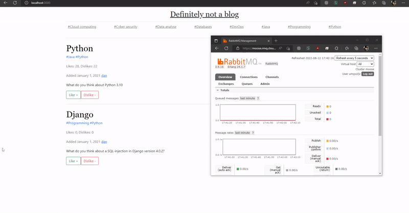
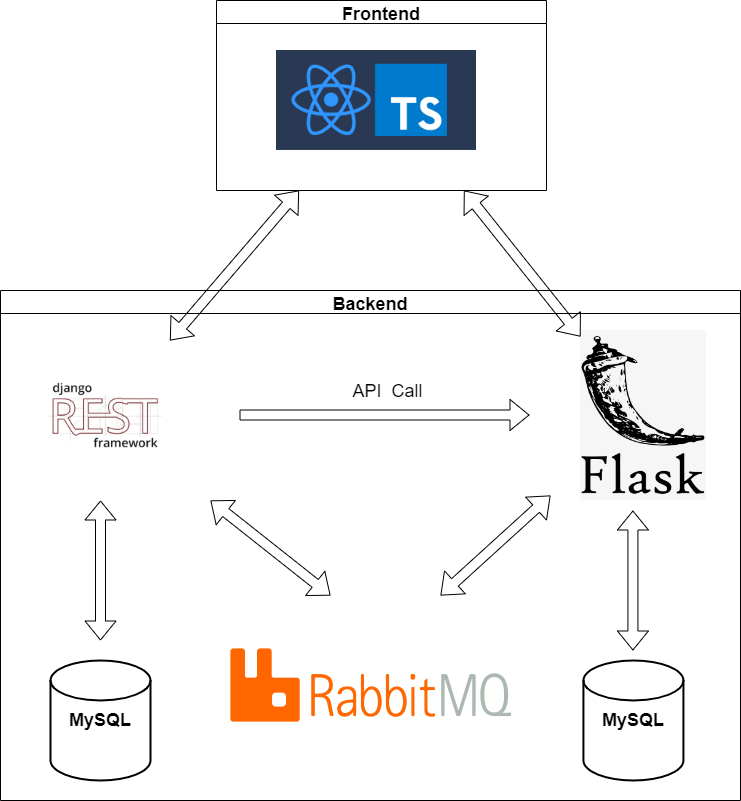

## DjangoRestFramework-Flask-ReactTypescript-Blog-app
[](https://www.python.org/dev/peps/pep-0008/)
[](https://www.gnu.org/licenses/gpl-3.0)

<p align="center">
  
</p>

## About application 
Blog made with Django with DjangoRestFramework, Flask, RabbitMQ and React Typescript. It uses the API to communicate beetwen FrontEnd and Backend layer. Project consist of dockerized Django and Flask application and React Typescript app. 
## Features 
- list posts by certain tag
- liking and disliking posts
- liking and disliking comments
- adding tags, comments and posts and users using API

## Technologogies
- Backend: [Django](https://www.djangoproject.com/), [Flask](https://flask.palletsprojects.com/en/2.2.x/)
- Database [MySQL](https://www.mysql.com/)
- Message-broker [RabbitMQ](https://www.rabbitmq.com/)
- Contenerization [Docker](https://www.docker.com/)

## System Design
<p align="center">
  
</p>

## Getting started
1. Change [consumer.py](Django_RestFramework_Microservice/app/consumer.py) and [prodcuer.py](Django_RestFramework_Microservice/app/posts/producer.py) for your own pika.URLParameters for Django app
1. Change [consumer.py](Flask_Microservice_backend/consumer.py) and [prodcuer.py](Flask_Microservice_backend/producer.py) for your own pika.URLParameters for your own in Flask app
3. Run the Django application (Django_RestFramework_Microservice)
```
cd app
docker-compose up --build
```
4. Run Flask application (Flask_Microservice_backend)
```
docker-compose up --build
```
5. Run typescript application (React_microservice_frontend)
```
npm start
```


