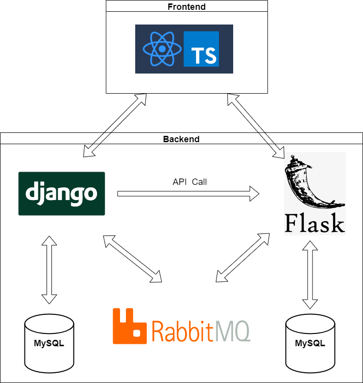

## DjangoRestFramework-Flask-ReactTypescript-Blog-app
[](https://www.python.org/dev/peps/pep-0008/)
[](https://www.gnu.org/licenses/gpl-3.0)
<p align="center">
  
</p>

## About project
The goal of the project was to create a simple blog with Django and DjangoRestFramework, Flask, RabbitMQ and ReactTypescript. Data from the backend to the frontend is sent via an API
## Features
- adding tags, users, posts and comments
- listing posts by certain tag
- liking and disliking posts and comments
- listing comments by clicking at certain post
## Technologies
- backend: [Django](https://www.djangoproject.com/), [DjangoRestFramework](https://www.django-rest-framework.org/), [Flask](https://flask.palletsprojects.com/en/2.2.x/)
- frontend: [ReactTypescript](https://www.typescriptlang.org/docs/handbook/react.html)
- database: [MySQL](https://www.mysql.com/)
- message-broker: [RabbitMQ](https://www.rabbitmq.com/)
## System design
<p align="center">
  
</p>

## Getting started
1. Change pika url in [producer.py](Django_RestFramework_Microservice/app/posts/producer.py) and [consumer.py](Django_RestFramework_Microservice/app/consumer.py) for Django app. You can use e.g [CloudAMPQ](https://www.cloudamqp.com/)
2. Change pika url in [producer.py](Flask_Microservice_backend/producer.py) and [consumer.py](Flask_Microservice_backend/consumer.py)
3. Run Django app
```
cd app
docker-compose up --build
```
5. Database migration for Django
```
docker-compose exec backend sh
python manage.py makemigrations posts
python manage.py migrate
```
6. Run Flask app
```
docker-compose up --build
```
7. Database migration for Flask
```
docker-compose exec backend sh
export FLASK_APP=main.py
flask db init
flask db migrate
flask db upgrade
```
8. Run React app
```
npm start
```
## Testing
In order to run Django tests run
```
docker-compose exec backend sh
python manage.py test posts
```

